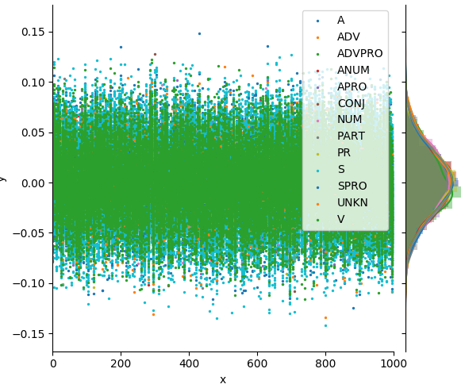
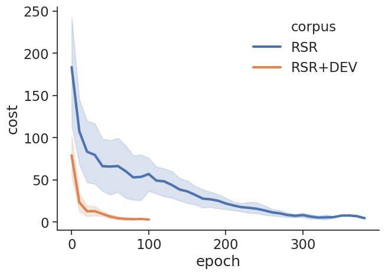
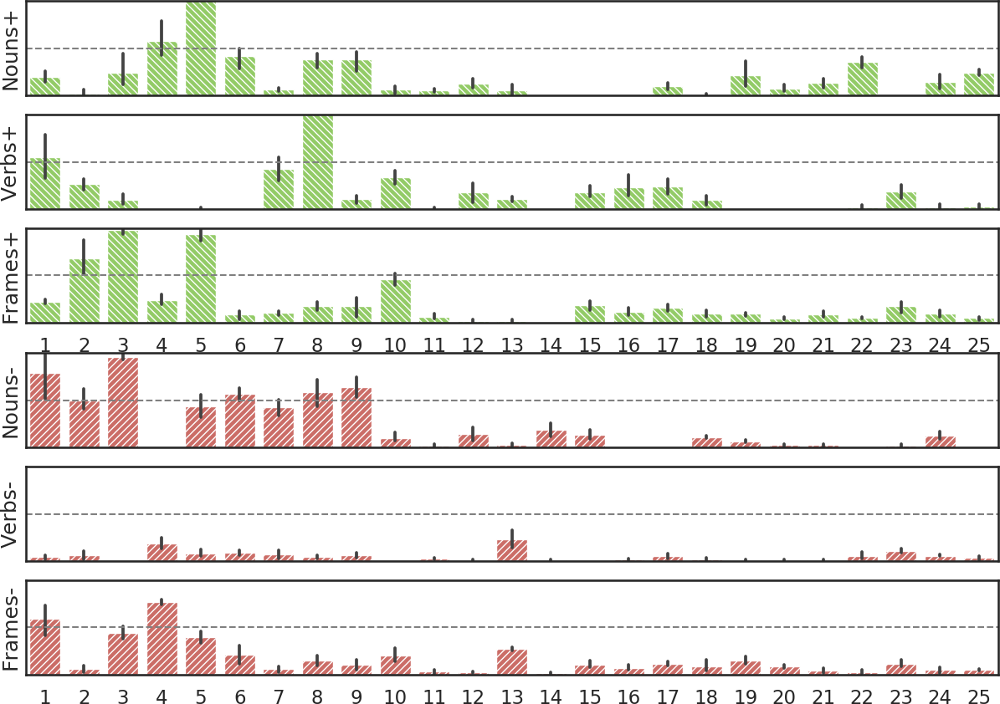
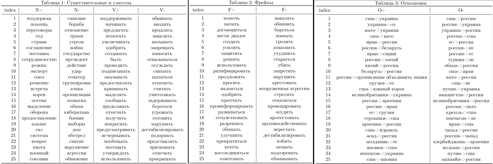

# Application of Distant Supervision in Sentiment Attitudes Classification Task


> **UPD March 31st, 2020:** In order to results reproduction in the case of  `RSR` and `RSR+RA` experiments, 
it is important to consider only those opinions that could be fitted in a single context.
Please proceed the [Evaluation section](#evaluation) in this description for details.

> **UPD December 3rd, 2019:** `core` folder nowadays is an [AREkit](https://github.com/nicolay-r/AREkit) framework, and [ranlp-2019](https://github.com/nicolay-r/AREkit/tree/ranlp-2019) branch of the latter represents the same code included into this repository.

This repository provides a source code of models and related experiments, 
conducted as a part of the following paper:

* Distant Supervision for Sentiment Attitude Extraction
/
[[paper-aclweb]](https://www.aclweb.org/anthology/R19-1118),
[[poster]](docs/ranlp_2019_poster_portrait.pdf)
    * Rusnachenko Nicolay, Loukachevitch Natalia, Tutubalina Elena
    * RANLP-2019

## Data Source References

1. [RuSentRel-1.1](https://github.com/nicolay-r/RuSentRel) -- utilized in experiments as a source of etalon attitudes;

2. [RuSentiFrames-1.0](https://github.com/nicolay-r/RuSentiFrames) -- utilized as a list of frame-entries in Frame-Based approach;

3. [RuAttitudes-1.0](https://github.com/nicolay-r/RuAttitudes) -- is a colection, developed in related paper.

## Convolutional Neural Networks for Relation Extraction 

Checkout [networks](/networks) folder for implementation details.

Architecture aspects of models are as follows:

* We utilize **Position Feature (PF)** -- is an embedding of distance between a given word towards each entity pair
This feature has been originaly proposed in [1];

* We apply and [implement](networks/context/architectures/pcnn.py) 
the related architecture dubbed as  **Piecewise Convolutional Neural Network** (PCNN) [2];

* This repository provides an [implementation](networks/mimlre) of the related architecture 
(Figure 2 above) in a way of a framework that allows to train models by matching a context (group of sentences) 
towards sentiment label. 
It assumes to utilize different sentence encoders: CNN, PCNN, etc. [3].

### Related Works

1. **Relation Classification via Convolutional Deep Neural Network** 
[[paper]](http://www.aclweb.org/anthology/C14-1220) 
[[code]](https://github.com/roomylee/cnn-relation-extraction) 
[[review]](/relation_extraction/Relation_Classification_via_Convolutional_Deep_Neural_Network.md)
	* Daojian Zeng, Kang Liu, Siwei Lai, Guangyou Zhou and Jun Zhao
	* COLING 2014

2. **Distant Supervision for Relation Extraction via Piecewise Convolutional Neural Networks**
[[paper]](http://www.emnlp2015.org/proceedings/EMNLP/pdf/EMNLP203.pdf) 
[[review]](/relation_extraction/Distant_Supervision_for_Relation_Extraction_via_Piecewise_Convolutional_Neural_Networks.md) 
[[code]](https://github.com/nicolay-r/sentiment-pcnn)
	* Daojian Zeng, Kang Liu, Yubo Chen and Jun Zhao
	* EMNLP 2015

3. **Relation Extraction with Multi-instance Multi-label Convolutional Neural Networks** 
[[paper]](https://pdfs.semanticscholar.org/8731/369a707046f3f8dd463d1fd107de31d40a24.pdf) 
[[review]](/relation_extraction/Relation_Extraction_with_Multi-instance_Multi-label_Convolutional_Neural_Networks.md)
	* Xiaotian Jiang, Quan Wang, Peng Li, Bin Wang
	* COLING 2016
	
## Training

We utilize two different approaches:

1. **Single Sentence Training:** matching label towards a single sentence.
    * Models: ```CNN```, ```PCNN```

2. **Multi Sentence Training:** matching a label towards the sentences set.
    * Models: ```MI-CNN```, ```MI-PCNN```
    
### Masking Entities in Model Input
    
Named entities, which are related to *Subject* and *Object* of a given attitude, 
considered as **masked**. 
[[proof]](https://github.com/nicolay-r/attitudes-extraction-ds/blob/c7eee45209d95d500f6c00b4d93bbba6887cbf37/networks/context/processing/sample.py#L132)

For example, given an attitude 'USA'->'Russia' with the following context:

* Original: "... [USA] is considering the possibility of new sanctions against [Russia] ..."
* Masked: "... **[MASK]** is considering the possibility of new sanctions against **[MASK]** ..."

> **NOTE:** Other named entities, mentioned in text, **remains non-masked**.

### Model Output

The output of trained model is a **two scale** sentiment score: {pos, neg}. [see Note below]
> **NOTE:** We adopt model designed for sentiment attitudes **extraction**, 
which actually utilize [three scaled](https://github.com/nicolay-r/attitudes-extraction-ds/blob/dcbe4f762f38827df3a042326be768c385b82ca6/predict_nn/ranlp/utils.py#L71) 
output {pos, neg, **neutral**}, 
but there were no attitudes with 
neutral score during in train/test subsets; 
result model may return **neutral** score, however the amount 
of related attitudes was significantly low.

### Evaluation


**Evaluation results, described in paper** [[download]](data/eval_model_results.zip)

**IMPORTANT**: Evaluation assumes to treat **only those pairs** which could be found in text as within a single sentence, 
and also within a context, limited by `TermsPerContext`.
In turns, attitude labeling in RuSentRel include ones that could not be fitted and described by a limited context.
Utilizing the latter in evaluation process, results in a decreased **Recall** and hence in decreased results by `F1`.

## Embedding Analysis

For words we utilize a pretrained Word2Vec model:

 **RusVectores news-embedding (vector_size=1000)** 
[[download]](https://rusvectores.org/static/models/rusvectores2/news_mystem_skipgram_1000_20_2015.bin.gz)

Figure below illustrates embedding parameters distribution for each POS class 
of first 1000 (out of 147k) words in embedding vocabulary.
It is possible to see that parameters has a normal distribution.



> NOTE: To generate **token embedding vectors** , we utilize `numpy.random_sample` in [0, 1] region.

> NOTE: To generate **feature embedding vectors** , we utilize `tf.random_normal_initializer`.
	
## Model Training Process Analysis

> **UPD September 29th, 2019:** It was found that hiddent states may vary out of [-1, 1] region 
(see heatmap gif image below).
In case of CNN, `tf.random_normal` call for initialization was used.
Large values may negatively results on gradient.


Figure below illustrates a variation in cost during model training process, in two experiments: 
```RSR``` and ```RSR+RA```(RSR+DEV in figure).

An application of RuAttitudes in ```RSR+RA``` 
experiment **results in faster training process**, 
in comparison with ```RSR``` experiment:



> **UPD October 6th, 2019:** Weights initialization of cnn-based models are `random_normal`.
Switching to `xavier` results in increased training speed, since weights become in a [-1, 1] 
region by the beginning.
However the latter does not affects on result.

> **UPD August 1st, 2019:** The assumption here is a significantly increased scale of training set in case of ```RSR+RA``` experiment.

## Investigating the Difference: Result Analysis 

Analysis of **difference set** between ```RSR``` and ```RSR+RA``` results in: 
  1. [List](docs/discrepancy_stat.pdf) of 25 most frequent verbs (V), nonuns (N), frames (F), opinions(O), separately 
  for positive (+) and negative (-) classes.
  2. Related statistic combined with frequencies of related verbs/nouns/frames in RuAttitudes.
  
     Bar candles illustrate a variation of frequencies across different models: 
     ```CNN```, 
     ```PCNN```, 
     ```MI-CNN```, 
     ```MI-PCNN```. 
     

>  NOTE: In figure above, X axis indices related to terms, presented in [List](docs/discrepancy_stat.pdf), or figure below



## Installation

All the related resources were used in experiment presented in `data` folder. 
It is necessary to unpack and download (news embedding), as follows:
```
cd data && ./install.sh
```

## References

```
@inproceedings{rusnachenko-etal-2019-distant,
    title = "Distant Supervision for Sentiment Attitude Extraction",
    author = "Rusnachenko, Nicolay  and
      Loukachevitch, Natalia  and
      Tutubalina, Elena",
    booktitle = "Proceedings of the International Conference on Recent Advances in Natural Language Processing (RANLP 2019)",
    month = sep,
    year = "2019",
    address = "Varna, Bulgaria",
    publisher = "INCOMA Ltd.",
    url = "https://www.aclweb.org/anthology/R19-1118",
    doi = "10.26615/978-954-452-056-4_118",
    pages = "1022--1030"
}
```
